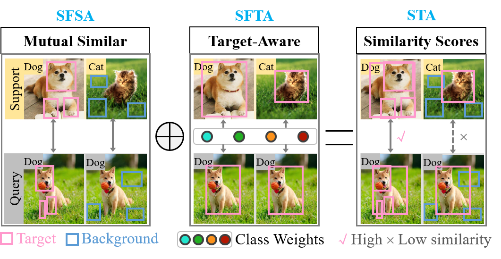
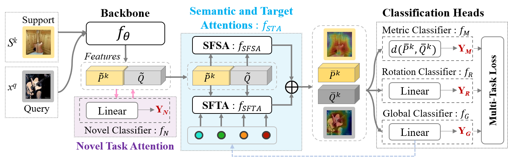
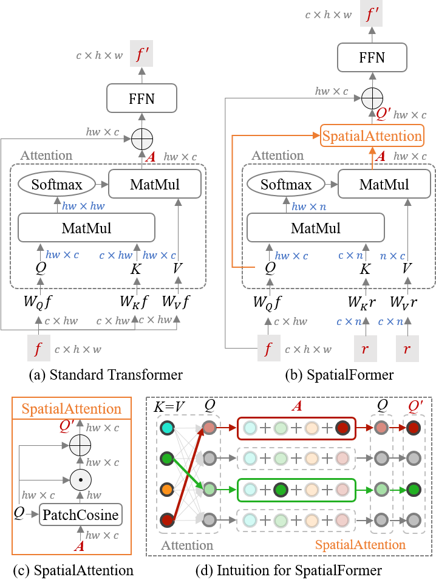
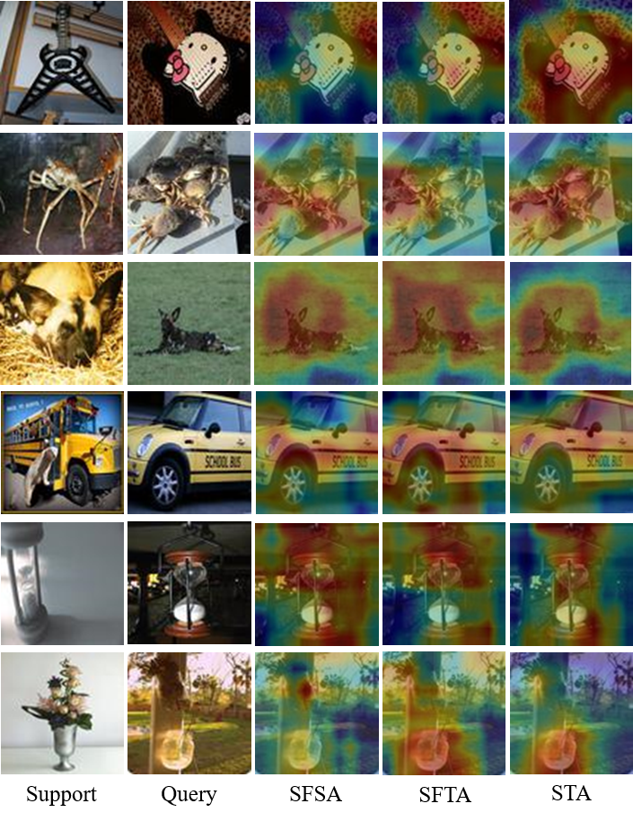

# SpatialFormer: Semantic and Target Aware Attentions for Few-Shot Learning
This is an official implementation in PyTorch of SpatialFormer, which is accepted by AAAI-2023.

This code cantains implementations of 4 methods, including SpatialFormer, CECNet, tSF, and AMTNet.

(1) SpatialFormer: Semantic and Target Aware Attentions for Few-Shot Learning. AAAI 2023.

(2) CECNet: Clustered-patch Element Connection for Few-shot Learning. IJCAI 2023.

(3) tSF: Transformer-based Semantic Filter for Few-Shot Learning. ECCV 2022.

(4) AMTNet: Rethinking the Metric in Few-shot Learning: From an Adaptive Multi-Distance Perspective. ACMMM 2022.


<p align="center">
  </a>
</p>

<p align="center">
  </a>
</p>


## Abstract

Recent Few-Shot Learning (FSL) methods put emphasis on generating a discriminative embedding features to precisely measure the similarity between support and query sets. Current CNN-based cross-attention approaches generate discriminative representations via enhancing the mutually semantic similar regions of support and query pairs. However, it suffers from two problems: CNN structure produces inaccurate attention map based on local features, and mutually similar backgrounds cause distraction. To alleviate these problems, we design a novel SpatialFormer structure to generate more accurate attention regions based on global features. Different from the traditional Transformer modeling intrinsic instancelevel similarity which causes accuracy degradation in FSL, our SpatialFormer explores the semantic-level similarity between pair inputs to boost the performance. Then we derive two specific attention modules, named SpatialFormer Semantic Attention (SFSA) and SpatialFormer Target Attention (SFTA), to enhance the target object regions while reduce the background distraction. Particularly, SFSA highlights the regions with same semantic information between pair features, and SFTA finds potential foreground object regions of novel feature that are similar to base categories. Extensive experiments show that our methods are effective and achieve new state-of-the-art results on few-shot classification benchmarks.

<p align="center">
  </a>
</p>

<p align="center">
  </a>
</p>


## Repository Overview
The repository is structured as follows:
- args_mini.py/args_tiered.py: Training-related configuration files.
- test_mini_args.py/test_tiered_args.py: Testing-related configuration files.
- train.py: Start training file.
- test.py: Start testing file.
- torchFewShot/: implementation source code.
- doc/: Related documentation.


## Requirements
- Torch >= 1.6.0
- Torchvision >= 0.7.0
- Python == 3.6


## Datasets
Refer to https://github.com/blue-blue272/fewshot-CAN.
<!-- ### mini-Imagenet
For mini-Imagenet experiments, please download mini-Imagenet and put it in ./miniImagenet/data/miniImagenet
and run proc_image.py to preprocess generate train/val/test datasets. (This process method is based on maml).

### tiered-Imagenet
For tiered-Imagenet experiments, please download tiered-Imagenet and put it in ./tieredImagenet/data/
tiered-Imagenet: https://drive.google.com/open?id=1g1aIDy2Ar_MViF2gDXFYDBTR-HYecV07
https://github.com/renmengye/few-shot-ssl-public

```
mkdir -p tieredImagenet/data/tieredImagenet/data
tar -xvf tiered-imagenet.tar
mv *.pkl tieredImagenet/data/tieredImagenet/data
``` -->

## Training
python3 -m torch.distributed.launch --nproc_per_node=4 train.py

## Testing
python3 -m torch.distributed.launch --nproc_per_node=2 test.py

## Inference
python3 inference_classifier.py


## Citation

If you use this code for your research, please cite our paper:
```
@article{lai2023spatialformer,
  title={SpatialFormer: Semantic and Target Aware Attentions for Few-Shot Learning},
  author={Lai, Jinxiang and Yang, Siqian and Wu, Wenlong and Wu, Tao and Jiang, Guannan and Wang, Xi and Liu, Jun and Gao, Bin-Bin and Zhang, Wei and Xie, Yuan and Wang, Chengjie},
  journal={AAAI},
  year={2023}
}
```

## Acknowledgments

This code is based on the implementations of [**tSF: Transformer-based Semantic Filter for Few-Shot Learning**](https://github.com/Layjins/FewShotLearning-tSF).
